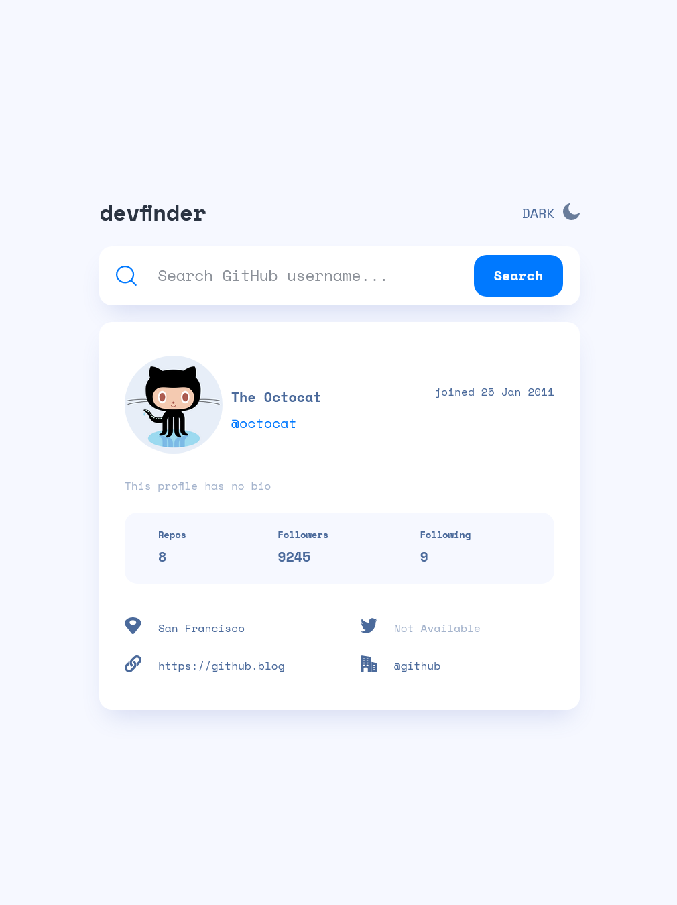
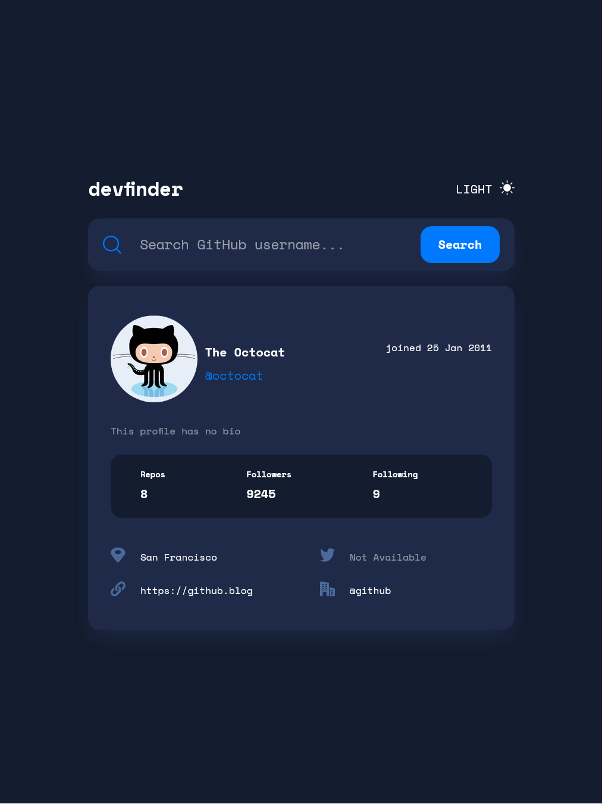

# Frontend Mentor - GitHub user search app solution

This is a solution to the [GitHub user search app challenge on Frontend Mentor](https://www.frontendmentor.io/challenges/github-user-search-app-Q09YOgaH6). Frontend Mentor challenges help you improve your coding skills by building realistic projects.

## Table of contents

- [Overview](#overview)
  - [The challenge](#the-challenge)
  - [Screenshot](#screenshot)
- [My process](#my-process)
  - [Built with](#built-with)
  - [Continued development](#continued-development)
  - [Useful resources](#useful-resources)
- [Author](#author)

## Overview

### The challenge

Users should be able to:

- View the optimal layout for the app depending on their device's screen size
- See hover states for all interactive elements on the page
- Search for GitHub users by their username
- See relevant user information based on their search
- Switch between light and dark themes

### Screenshot

Desktop Light

Desktop Dark

Tablet Light

Tablet Dark

Phone Light

Phone Dark

### Links

- Solution URL: [https://github.com/Zolfikaar/github-search](https://github.com/Zolfikaar/github-search)
- Live Site URL: [Add live site URL here](https://your-live-site-url.com)

## My process

### Built with

- Semantic HTML5 markup
- CSS custom properties
- Flexbox
- CSS Grid

### Continued development

I need to keep testing this bonus task (`prefers-color-scheme` in CSS), and check how i can use it without conflicting it's behavior with my custom theme script, in general i didn't like the way its work, i prefer javascript approach if that possible.

### Useful resources

- [Javascript Date Object](https://developer.mozilla.org/en-US/docs/Web/JavaScript/Reference/Global_Objects/Date) - This helped me for dealing/changing between different date format.
- [CSS Grid Generator](https://cssgrid-generator.netlify.app/) - This amazing tool helped me generating the desired grid layout. I'd recommend it to anyone who know the concept.

## Author

- Frontend Mentor - [@Zolfikaar](https://www.frontendmentor.io/profile/Zolfikaar)
